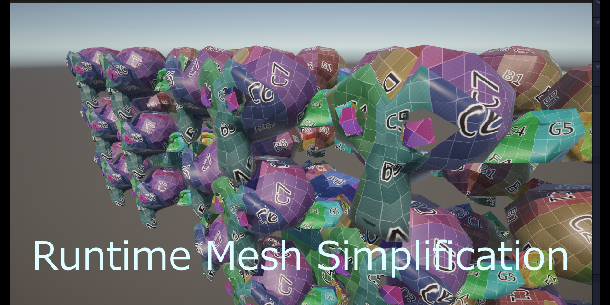

# Runtime Mesh Simplification

Welcome to the Runtime Mesh Simplification Repository!  
This project provides a collection of script samples that simplify meshes in real-time using multi-threading, enabling efficient   rendering and performance improvements in applications with complex geometries, without sacrificing rendering frame rates.  



## Features
- **Runtime Simplification:** Simplify meshes at runtime.  
- **Preservation of Details:** The algorithm intelligently preserves important details to achieve the specified quality, ensuring high-quality visual output.  
- **Optimization:** Significantly reduce the number of vertices and triangles, leading to faster rendering times and smoother user experiences.  
- **Easy Integration:** Integration into existing projects is seamless – just pass an array of MeshFilters to a coroutine.  
- **Threading:** Processing is offloaded to separate threads wherever possible to maintain rendering frame rates.  

## Getting Started
Follow these steps to integrate Runtime Mesh Simplification into your project:

1. Clone this repository.
1. Open the project from the cloned folder using Unity Hub.
1. Open the sample scene to understand the process of mesh simplification.

# ランタイム メッシュ簡素化

**ランタイム メッシュ簡素化** リポジトリへようこそ！  
このプロジェクトは、複雑なジオメトリを含むアプリケーションでの効率的なレンダリングとパフォーマンス向上を可能にするため  
描画フレームレートを落とさないよう、マルチスレッド処理にてメッシュをリアルタイムで簡素化するスクリプトサンプル群です。

## 特徴

- **ランタイム簡素化:** 実行時にメッシュをランタイムで簡素化します。
- **細部の保持:** 指定した品質を目指してアルゴリズムは重要なディテールを賢く保持し、高品質の視覚出力を確保します。
- **最適化:** 頂点と三角形の数を著しく減少させ、レンダリング時間の短縮とスムーズなユーザーエクスペリエンスを実現します。
- **簡単な統合:** コルーチンにMeshFilterの配列を渡すだけなので、既存のプロジェクトに簡素化プロセスをシームレスに統合します。
- **別スレッド化:** 描画フレームレートを落とさないようにするために、可能な限り処理が別スレッドで実行されます。

## 始め方

以下の手順に従って、ランタイム メッシュ簡素化をプロジェクトに統合します：

1. このリポジトリをクローンします。
1. Unity Hub 経由でクローンしたフォルダからプロジェクトを開きます。
1. サンプルシーンを開いて、メッシュの簡素化処理を理解します。

## How to use

```csharp
using System.Collections;
using System.Linq;
using Unity.Collections;
using Unity.Jobs;
using UnityEngine;
using System.Threading.Tasks;
using UnityMeshSimplifier;
using Unity.Jobs.LowLevel.Unsafe;

namespace SimplestarGame
{
    public class SimpleMeshAPISample : MonoBehaviour
    {
        [SerializeField] Transform referenceTarget;
        [SerializeField] Vector3 offsetPosition;
        [SerializeField, Range(0, 1)] float quality = 1f;
        [SerializeField] bool recalculateNormals = true;

        float startTime;
        float duration = 0.016f;

        MeshSimplifier SimplifyMesh(MeshSimplifier meshSimplifier, Mesh.MeshData meshData)
        {
            meshSimplifier.SetMeshData(meshData);
            meshSimplifier.SimplifyMesh(this.quality);
            return meshSimplifier;
        }

        void MakeCustomLayoutMeshJob(Mesh.MeshDataArray meshDataArray, CustomLayoutMesh customLayoutMesh, MeshSimplifier simplifier, int meshIdx)
        {
            int subMeshCount = simplifier.SubMeshCount;
            int[][] subMeshTrianglesArray = new int[subMeshCount][];
            for (int subIdx = 0; subIdx < subMeshCount; subIdx++)
            {
                subMeshTrianglesArray[subIdx] = simplifier.GetSubMeshTriangles(subIdx);
            }
            customLayoutMesh.SetMeshData(meshDataArray, meshIdx, subMeshCount, subMeshTrianglesArray,
                simplifier.Vertices, simplifier.Normals, simplifier.Tangents, simplifier.Colors, simplifier.UV1);
        }

        static int GetNearestPowerOfTwo(int value)
        {
            int powerOfTwo = 1;

            while (powerOfTwo < value)
            {
                powerOfTwo *= 2;
            }

            int lowerPowerOfTwo = powerOfTwo / 2;
            int upperPowerOfTwo = powerOfTwo;

            return (upperPowerOfTwo - value) < (value - lowerPowerOfTwo) ? upperPowerOfTwo : lowerPowerOfTwo;
        }

        bool HasTimeElapsed()
        {
            float currentTime = Time.realtimeSinceStartup;
            float elapsedTime = currentTime - this.startTime;

            return elapsedTime >= this.duration;
        }

        void RestStartTime()
        {
            this.startTime = Time.realtimeSinceStartup;
        }

        IEnumerator Start()
        {
            MeshFilter[] meshFilters = this.referenceTarget.GetComponentsInChildren<MeshFilter>(true);
            if (this.HasTimeElapsed())
            {
                this.RestStartTime();
                yield return null;
            }
            // Copy
            Mesh[] sourceMeshes = meshFilters.Select(meshFilter => meshFilter.sharedMesh).ToArray();
            var customLayoutMesh = new CustomLayoutMesh(sourceMeshes.Length);
            for (int meshIdx = 0; meshIdx < sourceMeshes.Length; ++meshIdx)
            {
                if (this.HasTimeElapsed())
                {
                    this.RestStartTime();
                    yield return null;
                }
                var sourceMesh = sourceMeshes[meshIdx];
                customLayoutMesh.SetMeshData(meshIdx, sourceMesh);
            }
            JobHandle combinedHandle = customLayoutMesh.Schedule();
            if (!combinedHandle.IsCompleted)
            {
                yield return null;
            }
            combinedHandle.Complete();
            Mesh.MeshData[] meshDataArray = new Mesh.MeshData[sourceMeshes.Length];
            for (int meshIdx = 0; meshIdx < sourceMeshes.Length; meshIdx++)
            {
                if (this.HasTimeElapsed())
                {
                    this.RestStartTime();
                    yield return null;
                }
                meshDataArray[meshIdx] = customLayoutMesh.GetMeshData(meshIdx);
            }
            // Simplify
            Task<MeshSimplifier>[] simplifyTasks = new Task<MeshSimplifier>[sourceMeshes.Length];
            for (int meshIdx = 0; meshIdx < sourceMeshes.Length; meshIdx++)
            {
                if (this.HasTimeElapsed())
                {
                    this.RestStartTime();
                    yield return null;
                }
                var meshSimplifier = new MeshSimplifier();
                var meshData = meshDataArray[meshIdx];
                simplifyTasks[meshIdx] = Task.Run(() => SimplifyMesh(meshSimplifier, meshData));
            }
            customLayoutMesh.Dispose();
            int lastCompletedTaskIndex = 0;
            while (lastCompletedTaskIndex < simplifyTasks.Length)
            {
                if (!simplifyTasks[lastCompletedTaskIndex].IsCompleted)
                {
                    yield return null;
                }
                else
                {
                    lastCompletedTaskIndex++;
                }
            }
            customLayoutMesh.Allocate(simplifyTasks.Length);
            Task[] createJobTasks = new Task[simplifyTasks.Length];
            for (int meshIdx = 0; meshIdx < simplifyTasks.Length; ++meshIdx)
            {
                if (this.HasTimeElapsed())
                {
                    this.RestStartTime();
                    yield return null;
                }
                var newMeshDataArray = Mesh.AllocateWritableMeshData(1);
                var meshSimplifier = simplifyTasks[meshIdx].Result;
                var newMeshIndex = meshIdx;
                createJobTasks[meshIdx] = Task.Run(() => MakeCustomLayoutMeshJob(newMeshDataArray, customLayoutMesh, meshSimplifier, newMeshIndex));
            }
            lastCompletedTaskIndex = 0;
            while (lastCompletedTaskIndex < createJobTasks.Length)
            {
                if (!createJobTasks[lastCompletedTaskIndex].IsCompleted)
                {
                    yield return null;
                }
                else
                {
                    lastCompletedTaskIndex++;
                }
            }
            combinedHandle = customLayoutMesh.Schedule();
            if (!combinedHandle.IsCompleted)
            {
                yield return null;
            }
            combinedHandle.Complete();
            var newMeshes = new Mesh[simplifyTasks.Length];
            for (int meshIdx = 0; meshIdx < sourceMeshes.Length; meshIdx++)
            {
                if (this.HasTimeElapsed())
                {
                    this.RestStartTime();
                    yield return null;
                }
                newMeshes[meshIdx] = customLayoutMesh.ToMesh(meshIdx);
            }
            customLayoutMesh.Dispose();
            // Bake
            NativeArray<int> meshIds = new NativeArray<int>(newMeshes.Length, Allocator.Persistent);
            for (int meshIdx = 0; meshIdx < newMeshes.Length; ++meshIdx)
            {
                meshIds[meshIdx] = newMeshes[meshIdx].GetInstanceID();
            }
            var bakeMeshJob = new BakeMeshJob(meshIds);
            int innerloopBatchCount = GetNearestPowerOfTwo(meshIds.Length / JobsUtility.JobWorkerCount);
            var bakeMeshJobHandle = bakeMeshJob.Schedule(meshIds.Length, innerloopBatchCount);
            while (!bakeMeshJobHandle.IsCompleted)
            {
                yield return null;
            }
            bakeMeshJobHandle.Complete();
            meshIds.Dispose();
            for (int i = 0; i < newMeshes.Length; i++)
            {
                if (this.HasTimeElapsed())
                {
                    this.RestStartTime();
                    yield return null;
                }
                var newMesh = newMeshes[i];
                var sourceMeshFilter = meshFilters[i];
                GameObject newGameObject = new GameObject("ClonedMeshObject");
                newGameObject.transform.position = sourceMeshFilter.transform.position + this.offsetPosition;
                newGameObject.transform.rotation = sourceMeshFilter.transform.rotation;
                if (this.recalculateNormals)
                {
                    newMesh.RecalculateNormals();
                    newMesh.RecalculateTangents();
                }
                newGameObject.AddComponent<MeshFilter>().sharedMesh = newMesh;
                newGameObject.AddComponent<MeshRenderer>().sharedMaterials = sourceMeshFilter.GetComponent<MeshRenderer>().sharedMaterials;
                newGameObject.AddComponent<MeshCollider>().sharedMesh = newMesh;
            }
        }
    }
}
```

## License
This project is licensed under the MIT License.

## Contribution
If you find a bug, have an enhancement idea, or want to contribute in any other way, please open an issue or submit a pull request.
